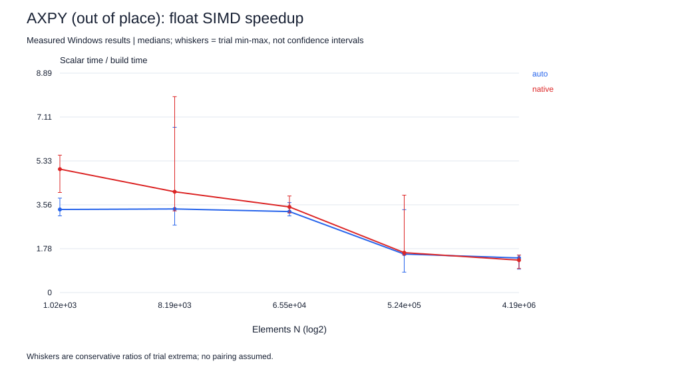
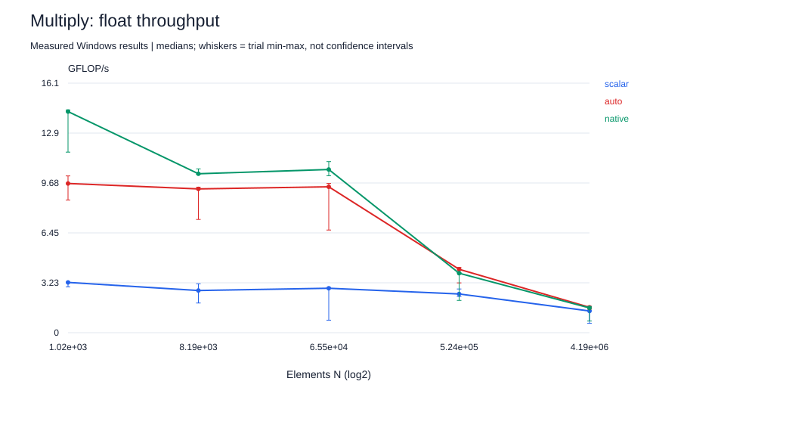

# Project 1 — SIMD advantage profiling

**For a young reader:** Can a computer carry several numbers at once instead of carrying them one by one? We tried both ways. Bigger handfuls helped on small jobs, but waiting for faraway numbers limited the gain on large jobs.

## What we built

Three kernels: out-of-place AXPY `z = 1.25*x + y`, elementwise multiply `z = x*y`, and dot product `s = sum(x*y)`. AXPY uses a distinct output so repeated trials have identical inputs rather than accumulating an ever-changing result. This is explicitly an out-of-place variation of the assignment's update kernel; it changes the footprint and store traffic relative to an in-place implementation.

The source uses `restrict` only for separate allocations. Inputs are deterministic binary fractions; correctness compares results to scalar double calculations. FMA contraction is disabled consistently. Strict addition order is retained for the dot product; no `-ffast-math` is used. Build flags are saved in `data/builds.json`.

| Build | Flags | Intent |
|---|---|---|
| Scalar | `-O3 -fno-tree-vectorize -ffp-contract=off` | Optimized scalar comparison |
| Auto | `-O3 -ffp-contract=off` | Default x86-64 vector target |
| Native | `-O3 -march=native -ffp-contract=off` | Host AVX2 vector target |

All required experiments are single-threaded on logical CPU 0. Native CPUID identifies it as a performance core, with 48 KiB L1 data, 1.25 MiB L2, and 12 MiB LLC reported. Cache sharing fields are topology encodings, not direct counts of active sharers. See `../common/topology.json`.

## Results and plots

Read [all measured tables](RESULTS.md). Values are medians of three trials; the approximately 60 ms minimum trial length makes this a short controlled comparison, not an isolated laboratory run.

At N=1,024, native float32 AXPY was 5.00x faster than scalar; at N=4,194,304 it was 1.31x. Multiply likewise fell from 4.40x to 1.14x. Float64 large-array AXPY was essentially unchanged at 1.01x. These outcomes support diminishing vector advantage as data movement becomes more important. They do not alone establish the exact DRAM traffic rate.

For AXPY/multiply the logical array footprint is `3*N*sizeof(T)` at unit stride; dot uses `2*N*sizeof(T)` although the implementation allocates a third array for shared harness simplicity. N is an element count, not bytes. Larger strides expand the allocated span and reduce useful cache-line utilization. The generated tables isolate aligned/misaligned starts and divisible/tail lengths, including very short loops where call/timer overhead can dominate.

## Verify the optimization

Lecture connection: Part 1-1's true dependencies and out-of-order execution explain the ordered dot accumulation; Part 1-2's SIMD/Amdahl discussion explains why lane count is not a promised speedup. See [source pages and interpretation](../docs/LECTURE-CONNECTIONS.md).

The saved compiler reports identify vectorized loops, including 32-byte vectors in the native build (eight floats or four doubles). Reports also include missed paths, so a single “vectorized” line is not proof that all stride variants use those instructions. Targeted assembly evidence is in [VECTOR-EVIDENCE.md](VECTOR-EVIDENCE.md); complete disassembly remains available as raw evidence.

The dot-product experiment is a negative case. The compiler can vectorize multiplication while preserving ordered scalar additions. That is not a fully parallel reduction. Native float32 dot was slower than scalar in the small and large reported examples. Do not rewrite the result as “AVX2 must always win.”

## Roofline interpretation

Arithmetic intensity is FLOPs per transferred byte. At the useful-array level, AXPY uses 2 FLOPs per 12 bytes for float32: **1/6 FLOP/byte**. Multiply uses 1/12; dot uses 2/8 = 1/4. Float64 halves these intensities. Physical traffic can be greater, particularly for out-of-place cached stores with write allocation.

The roofline bound is `performance <= min(compute peak, bandwidth * arithmetic intensity)`. The dedicated streaming bandwidth check and numerical sensitivity calculation are in [ROOFLINE.md](ROOFLINE.md). Its bandwidth is an effective application-level measurement, not a memory-controller counter reading. Frequency-dependent peak estimates must be labeled as estimates; no fixed turbo clock is assumed.

## Timing and limitations

QueryPerformanceCounter measures elapsed seconds. The harness also records invariant TSC ticks per element using fenced RDTSCP. **TSC ticks are not actual core cycles** on a frequency-scaling processor. Actual core cycles per element remain unavailable without suitable counters. The report does not relabel them.

Warm-up and correctness checks occur outside the timed interval. The output is consumed and compiler barriers keep repeated kernel calls observable. At very small N, timer and call overhead are significant; interpret tiny-loop comparisons as harness-inclusive costs. Background activity, varying clocks, finite sample count and non-identical operating temperature limit precision.

## Run

From the repository root: `python project-1-simd/scripts/run.py`, followed by `python common/analyze_all.py`. Save previous data before rerunning because result names are stable.
