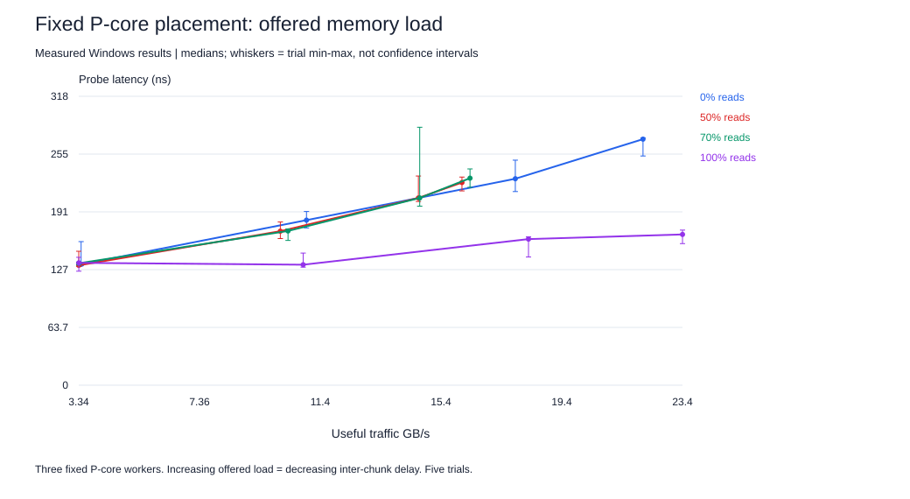

# Controlled memory follow-up

This dataset supplements, rather than overwrites, the original mixed-core measurements. It tests a methodological improvement prompted by the lecture discussion of placement and shared resources.

## Method

Probe CPU 0 and worker CPUs 2, 4, 6 are on four distinct P-cores, verified with the native Windows physical-core masks. Three workers each use 128 MiB. Read percentage and delay are swept while worker placement and count stay fixed. Each trial runs for at least 0.5 seconds; five trials per condition are interleaved with a fixed random seed. The separate baseline has no workers.

Workers check the stop signal between 128 KiB chunks instead of 128 MiB passes. Start lag and end overhang are measured. The traffic denominator spans probe start to latest worker completion; the probe has its own measured interval. Finite OS scheduling delays remain, so this is improved alignment rather than an assertion of perfectly identical windows.

Idle probe median: **125.94 ns/load**, trial range 123.52–146.97.

| Read % | Delay us/chunk | Median GB/s | Median ns/load | Start lag median us | End overhang median us |
|---|---|---|---|---|---|
| 0 | 100 | 3.41 | 133.12 | 122.1 | 0.8 |
| 0 | 20 | 10.92 | 181.85 | 157.8 | 1.2 |
| 0 | 5 | 17.87 | 227.49 | 96.5 | 14.1 |
| 0 | 0 | 22.12 | 271.11 | 137.1 | 11.7 |
| 50 | 100 | 3.34 | 132.05 | 389.8 | 0.6 |
| 50 | 20 | 10.05 | 169.69 | 129.9 | 22.3 |
| 50 | 5 | 14.64 | 206.30 | 217.0 | 17.2 |
| 50 | 0 | 16.09 | 223.31 | 996.2 | 22.9 |
| 70 | 100 | 3.34 | 134.34 | 105.9 | 0.5 |
| 70 | 20 | 10.30 | 169.95 | 808.7 | 17.2 |
| 70 | 5 | 14.69 | 206.33 | 75.2 | 18.1 |
| 70 | 0 | 16.36 | 228.12 | 139.5 | 16.0 |
| 100 | 100 | 3.34 | 134.81 | 140.9 | 0.7 |
| 100 | 20 | 10.81 | 132.75 | 103.1 | 0.7 |
| 100 | 5 | 18.31 | 160.98 | 134.2 | 12.6 |
| 100 | 0 | 23.44 | 166.11 | 119.7 | 13.1 |

Maximum observed start lag was 31079.7 us and end overhang 4387.1 us. Compare these with approximately 500,000 us per trial rather than silently treating synchronization as exact.

## Interpretation and remaining evidence

If decreasing the delay produces more throughput and increased latency, that is consistent with growing shared-resource pressure. If the curve does not plateau, the sampled intensity range does not establish saturation. The delay loop itself consumes worker execution resources, and the scalar traffic kernel has instruction overhead. Neither useful bandwidth nor this curve alone proves DRAM-bus saturation.

This is multicore traffic, not an SMT experiment: sibling logical CPUs are deliberately avoided. A separate probe is still a different request population from the streamers, so Little's Law cannot yield exact streamer occupancy by combining them. Counter attribution remains pending the administrator capture.

## Reproduce

`python project-2-memory/scripts/run_controlled.py`, followed by `python project-2-memory/scripts/analyze_controlled.py`, from the repository root. Native core masks must already be recorded in `common/core-masks.json`. The source/environment hashes and raw trial order are retained under `data/controlled/`.