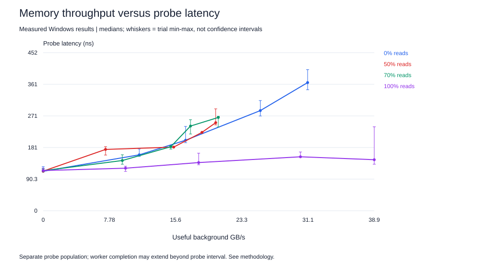
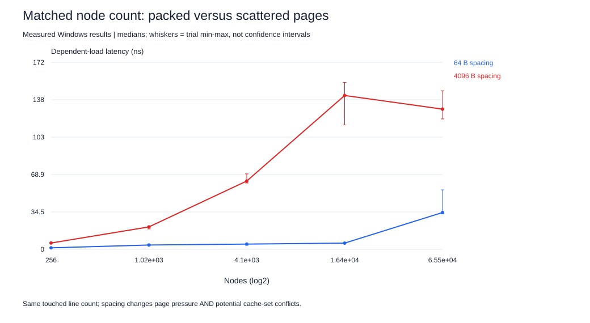

# Project 2 — Cache and memory performance profiling

**For a young reader:** Finding a toy on your desk is usually quicker than going to a cupboard. If many children visit the cupboard together, the trip can take longer. We measured those waits and how many toys could be moved each second.

## What the experiment measures

The portable `membench.c` implements a dependent pointer chain for latency and a scalar streaming read/write kernel for useful throughput. A randomized permutation forms one complete cycle; validation checks every selected node and the final returned index. Addresses are not independent in the latency loop, preventing ordinary demand-load overlap. Predictable chains can still benefit from prefetching.

The added native Windows `loaded.c` pins the probe to logical CPU 0, allocates and initializes data before measurement, and starts background workers together using an event. Each worker owns a 128 MiB array; worker CPUs are 2, 4, 6, 8, 10 and 12. Native topology identifies 0-7 as P-core logical CPUs and 8-15 as E-core logical CPUs. Thus the 4- and 6-worker points add different core types; this is not a perfectly homogeneous concurrency sweep.

Read/write ratios describe 8-byte application operations. Ordinary cached stores introduce write allocation and delayed writeback, so the DRAM bus ratio and bytes moved are not directly measured. The scalar mix kernel also has branch/modulo and arithmetic overhead; useful throughput is not a certified peak DRAM bandwidth.

## Measurements

**Lecture-driven follow-up:** [Controlled results](CONTROLLED-RESULTS.md) add five repetitions per condition with three fixed P-core workers and measured synchronization lag/overhang. This addresses two weaknesses of the original run. The original data below is preserved as a distinct session. See [lecture connections](../docs/LECTURE-CONNECTIONS.md) for the distinction between ILP, SIMD, SMT and multicore traffic.

The original September 10 pilot contains 510 trials and is retained under `data/raw/pilot-*`. Its plots and initial interpretation remain in `docs/PILOT-README.md` and `data/processed/`. The September 14 extension adds 90 trials: 20 load/mix conditions and 10 matched-node page-spacing conditions, each repeated three times. [Extended results](EXTENDED-RESULTS.md) contain the measured tables.



At 50% reads, useful background throughput rose from 7.33 GB/s with one worker to 18.66 GB/s with four and 20.27 GB/s with six. Probe latency rose from 175.20 ns to 223.98 ns and 251.66 ns. The small four-to-six-worker throughput gain alongside increased latency is consistent with diminishing returns. It is not proof of a universal memory-system saturation point.

For pure reads, six workers achieved higher useful throughput but a lower probe median than four. Preserve this non-monotonic observation. Worker core type, frequency changes, sampling variability and contention placement are plausible contributors. Do not smooth it away.

## Latency baselines and cache interpretation

Native CPU 0 reports 48 KiB L1 data cache, 1.25 MiB L2 and 12 MiB LLC. A 64 B-spaced random chain uses one selected pointer per cache line. Compare touched cache-line volume, not just allocation span, to capacity.

The original random 64 B-stride pilot measured 1.38 ns at 4 KiB, 4.44 ns at 64 KiB, 7.87 ns at 1 MiB, and 135.51 ns at 4 MiB. The large jump at 4 MiB is not explained by the reported 12 MiB LLC size alone. A clean LLC-only latency has not been isolated, so the report does not label 135.51 ns as “L3 latency.” Timing includes actual processor, translation and system effects. These are low-load baselines, not a guarantee of zero queueing.

Sequential chains at large footprints are far faster than randomized chains. This is a benchmark pitfall: using predictable-chain timing as intrinsic DRAM latency would be misleading. The data supports an access-pattern effect; prefetching is a plausible architectural explanation.

## Page locality and TLB limits



The page study keeps node counts equal but places them 64 B or 4096 B apart. At 16,384 nodes, medians are 5.73 ns versus 141.78 ns. Scattered nodes need more translations, but 4096 B spacing can also cause cache-set conflicts. These timings alone cannot quantify TLB misses.

Native page size is 4096 B. Windows reports a 2 MiB large-page minimum, but the allocation attempt returned error 1314 (required privilege not held). No large-page performance result is fabricated. The WSL event-source directory contains software/trace sources but no hardware CPU PMU. Windows enumerates cache/cycle PMC sources, which does not guarantee recording access; see the [counter workflow](docs/COUNTERS.md).

## Queueing and AMAT

Little's Law requires matching request populations: outstanding requests = request rate × mean request latency. Our latency probe differs from the background streamers, so multiplying probe latency by streamer throughput cannot give an exact streamer queue occupancy. Use the combined graph as a qualitative contention study.

AMAT = hit time + miss probability × additional miss penalty. In a multilevel hierarchy use conditional miss rates and incremental costs. Because hardware cache/TLB counts are missing, no numerical AMAT decomposition is claimed.

## Timing controls and remaining work

Three trials per condition, shuffled order, deterministic initialization, warm-up and affinity are implemented. Balanced power policy, background OS activity and no exclusive CPU reservation limit repeatability. The probe runs at least 350 ms. Background workers finish their current full pass after the stop signal; `traffic_seconds` records the longest worker/probe interval, so throughput and probe windows are close but not identical. This overhang is a limitation for quantitative queueing claims.

Before claiming full rubric completion, collect cache/TLB events with matched runtime, isolate the ambiguous cache transitions, and extend/control load to establish a credible knee. A privileged native Windows profiler or a suitable native Linux machine could address the counter gap. Do not substitute invented counts, virtualized cache topology, or unsupported zeros.

## Run

From the repository root:

```text
python project-2-memory/scripts/run.py --profile pilot --cpu 0
python project-2-memory/scripts/run_extended.py
python common/analyze_all.py
```

The original runner is Windows/Linux portable; the extension uses native Windows threading. Linux execution of the original source has not been validated here. See `docs/learning-guide.md` for the first lesson and `../docs/RUBRIC.md` for exact remaining requirements.
