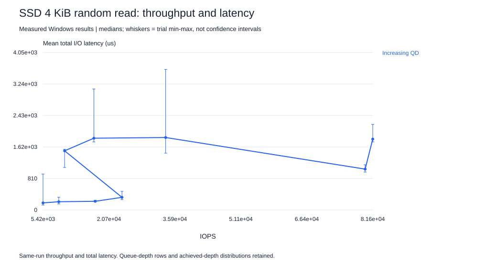
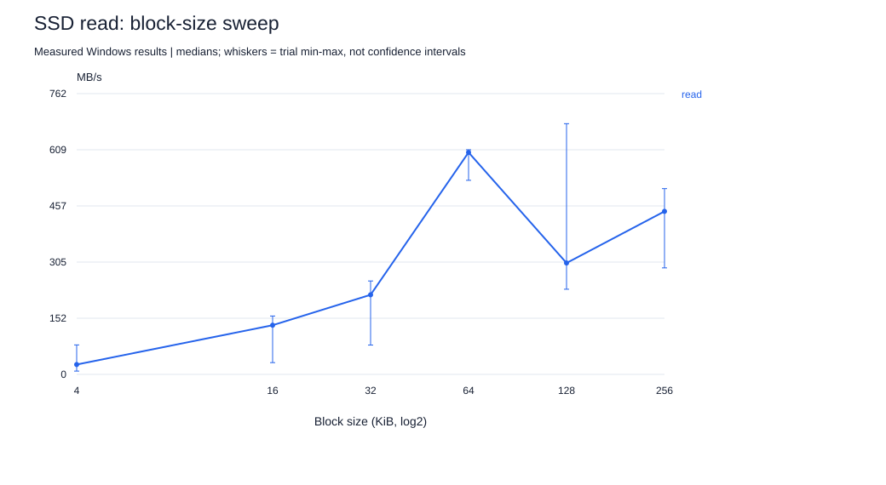

# Project 3 — SSD performance profiling

**For a young reader:** We asked a librarian to fetch and put away boxes. One request at a time is easy to understand. Several at once can keep the librarian busy. Too many can make the line longer. We measured both boxes per second and how long a box took.

## Device and safe test range

The connected system reports a **CT500P3PSSD8**, approximately 500 GB, on the active Windows system volume. WMI's `SCSI` interface field describes the Windows storage presentation; it is not proof the drive uses a physical SCSI link. Controller/PCIe negotiated link speed has not been measured. Source metadata is in `../common/ssd.json`.

We use **fio 3.42**, the native `windowsaio` asynchronous engine, one job, and a 2 GiB disposable file. No raw disk or partition is used. The runner checks available space and refuses a pre-existing target. It writes the full file before reads, then runs a separate 16 MiB CRC32C write/verify pass. Pre-filling makes reads meaningful; it does not establish device-wide steady state.

By default `direct=1` bypasses the OS file cache on this path. Only the explicitly named buffered-I/O pitfall changes it to zero. The device's internal cache remains active. Direct I/O completion is not a guarantee of power-loss persistence; no such claim is made.

## Controlled experiments

| Study | Fixed settings | Varied setting |
|---|---|---|
| QD1 latency | 2 GiB range, one job, direct I/O | Random 4 KiB read/write; sequential 128 KiB read/write |
| Block sizes | QD8, one job, direct I/O | 4, 16, 32, 64, 128, 256 KiB for sequential/random reads/writes |
| Mix | Random 4 KiB, QD8 | 100% read, 100% write, 70/30, 50/50 |
| Queue depth | Random 4 KiB reads, one job | 1, 2, 4, 8, 16, 32, 64; supplemental 128 and 256 |
| Range | Random 4 KiB reads, QD8 | 64 MiB vs 2 GiB file range |
| Misleading setup | Random 4 KiB reads, QD8, 64 MiB range | Buffered vs direct I/O |
| Device-state observation | Sequential 128 KiB writes, QD8 | 12-second time series with 1-second bandwidth logging |

Trials run for three measured seconds after a one-second ramp, repeated three times in shuffled order. Fio's process/setup time can make wall-clock execution longer. Seeds are fixed and `refill_buffers=1`, `buffer_compress_percentage=0` request incompressible buffers. Pattern generation itself can consume CPU; this is part of the tool's overhead.

The QD128/256 follow-up uses `scripts/extend_queue.py` and a freshly prefilled, separately named 2 GiB disposable file. Its six rows are marked `session=supplemental` in the index; they were not interleaved with the original 129 trials. Device-state drift can therefore confound comparisons across the two sessions. Approximately 25 GB was free on the 500 GB system volume before the first test file was allocated; this nearly full state is important context.

Read [measured results](RESULTS.md), inspect [original configurations](configs/), and retain the [raw fio JSON](data/raw/). The processed file preserves total I/O counts, total-latency p50/p95/p99/p99.9 for reads and writes separately, and achieved queue-depth distributions. A direction with zero I/Os has no measured latency; its raw zero is not a meaningful zero-latency result.

## How to interpret the curve

Throughput and mean total I/O latency come from the same fio run. For a mixed workload, the combined mean is weighted by read/write completion counts. Percentiles are kept separate because averaging read and write percentiles would not produce a valid combined percentile.

The operational knee is the first tested QD reaching at least 90% of the maximum observed median IOPS. If that occurs at the largest tested QD, the experiment has not established a plateau. Report the complete curve and investigate further before calling it the device's saturation point. Requested queue depth is not proof of useful parallelism; inspect the achieved-depth distribution.

Little's Law estimates average requests in the measured I/O population as `IOPS * mean_total_latency_seconds`. It should be interpreted alongside fio's `iodepth_level` distribution, submission behavior, and synchronous/asynchronous engine semantics. Configured queue depth is not automatically achieved queue depth.

## Tails, range and device state

The per-run latency histograms provide p50, p95, p99 and p99.9. Check total I/O counts before trusting an extreme percentile: p99.9 can represent very few events in a small sample. The same QD sweep supplies mid-range and near-knee observations; the derived tables identify those cases without inventing another dataset.

A 2 GiB file covers only part of the device's logical address range and is smaller than host RAM. Direct I/O is therefore essential to the intended interpretation. File-range comparisons are not equivalent to full-device LBA sweeps; filesystem layout and FTL mapping are unobserved.

The time series captures short-term write-rate changes. We do not claim fresh-out-of-box state, full preconditioning, SLC exhaustion, thermal throttling or steady state. Temperature/SMART data was not available in the recorded setup. The active OS also generates background I/O. These limitations should accompany any quoted peak value.

## Run

`python project-3-ssd/scripts/run.py --fio C:/path/to/fio.exe`, then `python common/analyze_all.py`, from the repository root. Use the official [fio releases](https://github.com/axboe/fio/releases). Options and percentile semantics follow the [fio documentation](https://fio.readthedocs.io/en/latest/fio_doc.html).
